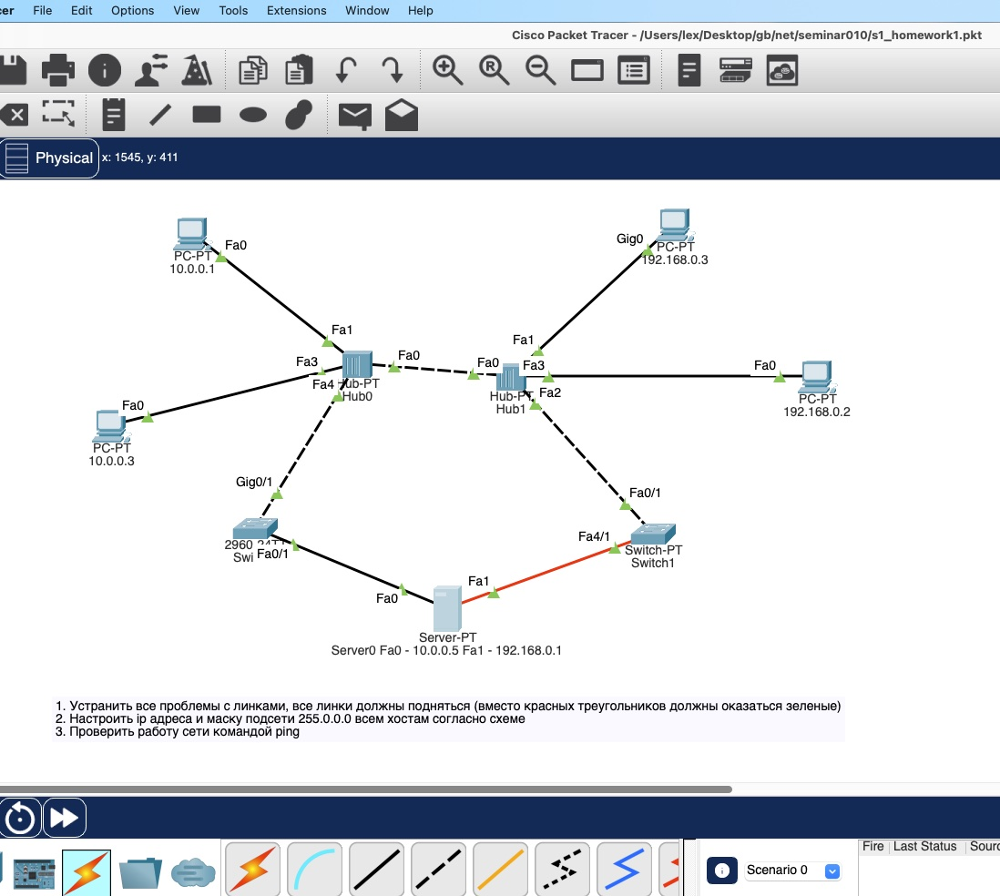
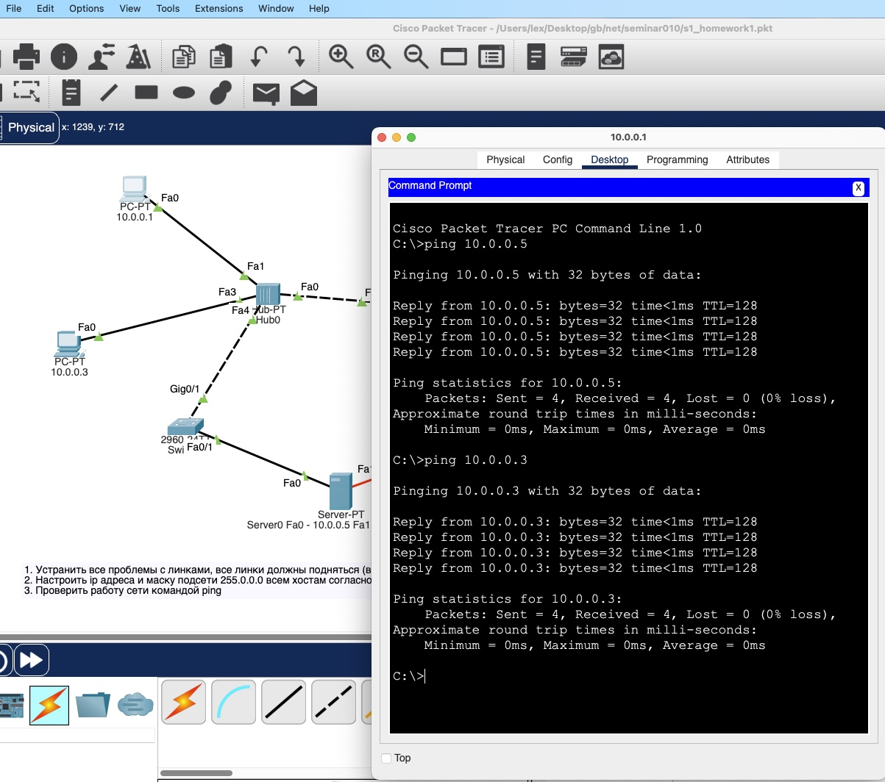
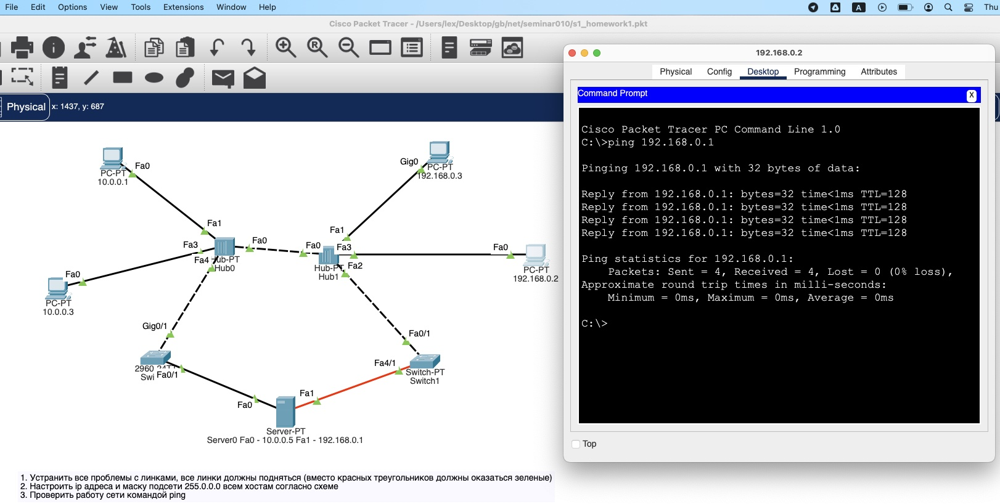

# Урок 1. Основы компьютерных сетей. Ethernet.

Починить сеть из , чтобы все линки были зеленые.

Попинговать компьютеры.

Сдать два скриншота успешного пинга с РС 10.0.0.1 на
интерфейс сервера Fa0 10.0.0.5 и на PC 10.0.0.2.

Сдать один скриншот успешного пинга с РС 192.168.0.2
на интерфейс сервера Fa1 192.168.0.1

