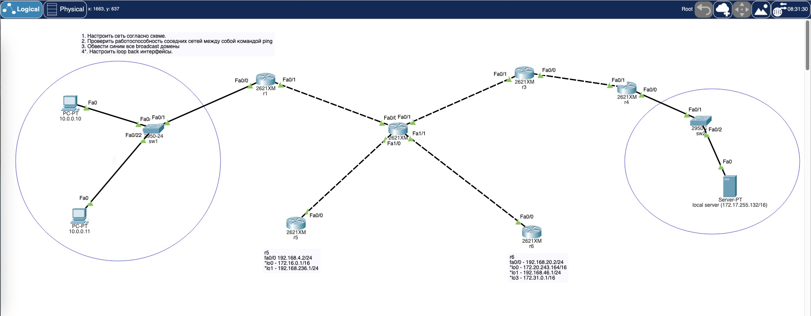
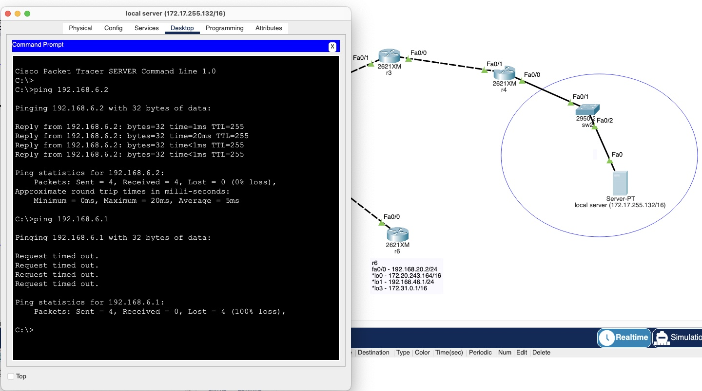
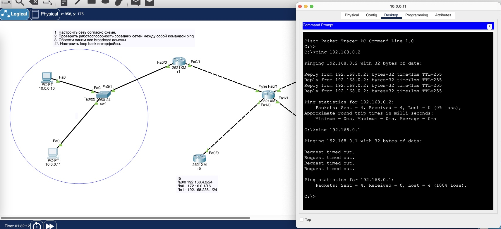

# Урок 2. Технология Ethernet. Протокол IP.

Условие:

## 1. Настроить сеть согласно схеме в файле https://disk.yandex.ru/d/1m4aUoqDm1SKBQ

Скинуть скриншоты с зелеными линками


## 2. Проверить работоспособность **соседних между собой** сетей командой ping. Понять почему один роутер отвечает, а другой нет.

успешные/неуспешные пинги между парой-тройкой соседних сетей (соседние сети - это Connected сети к одному роутеру).


успешный пинг c ip адрес 172.17.255.132 идет только на 192.168.6.2 потому, что это другой порт одного и того же роутера, и там есть таблица маршрутизации (ip route) с информацией, что за портом Fa0/0 находится сеть 172.17.0.0/16 - железка одна и та же (Router r4).
А на адрес 192.168.6.1 пинг не проходит, т.к. там уже другая железка (Router r3) и он ничего не знает, что за его портом Fa0/0 кроме сети 192.168.6.0/24 есть еще сеть 172.17.0.0/16.
На симуляции пакет с адреса 172.17.255.132 так и идет - сперва на 172.17.0.1, далее через 192.168.6.2 на 92.168.6.1 - тут все хорошо, роутер r4 знает за какими портами у него что лежит соседнее.
А вот роутер r3 пока знает только то, что за портом Fa0/0 у него лежит сеть 192.168.6.0/24, а пакет обратно надо отослать на ip 172.17.255.132 - и r3 такой пакет просто отбрасывает (drop).


Аналогичная ситуация с компьютерами в сети 10.0.0.0
С них тоже успешно пингуется соседний порт на одном и том же роутере (Router r1) потому что одна железка и на ней есть информация за каким портом какая сеть.
А соседний роутер (Router r2) уже не пингуется, т.к. он не знает, за каким портом у него лежит сеть 10.0.0.0/8.
И на него в симуляции также успешно приходят пакеты с двух компьютеров в сети 10.0.0.0/8, r1 их туда исправно доставляет. А вот пакеты ответа на пинг r2 послать не может, он ничего не знает про сеть 10.0.0.0/8, и поэтому дропает их.

## 3. Обвести синим все broadcast домены

Таблица MAC адресов со свича (Switch sw1) до пингов

```sudo
Switch#
Switch#show mac-address-table
          Mac Address Table
-------------------------------------------

Vlan    Mac Address       Type        Ports
----    -----------       --------    -----

   1    00e0.b0bd.e001    DYNAMIC     Fa0/1
Switch#
```

вывод таблицы ARP с компьютера 10.0.0.10 после пингов на соседний компьютер и на роутер

```sudo
C:\>arp -a
  Internet Address      Physical Address      Type
  10.0.0.1              00e0.b0bd.e001        dynamic
  10.0.0.11             00d0.9796.2a1d        dynamic
```

Таблица MAC адресов со свича (Switch sw1) после пингов

```sudo
Switch#
Switch#show mac-address-table
          Mac Address Table
-------------------------------------------

Vlan    Mac Address       Type        Ports
----    -----------       --------    -----

   1    0001.c76b.0bc6    DYNAMIC     Fa0/23
   1    00d0.9796.2a1d    DYNAMIC     Fa0/22
   1    00e0.b0bd.e001    DYNAMIC     Fa0/1
Switch#
```

## 4. Настроить loopback интерфейсы.

Это виртуальные програмные интерфейсы, к ним нельзя подключать реальные IP-сети
Их можно поднять и настроить на роутере в целях тестирования.
[CLI-r5-loopback.sh](file://CLI-r5-loopback.sh)
[CLI-r6-loopback.sh](file://CLI-r6-loopback.sh)

Войдем в режим конфигурирования на роутере

```sudo
Router#conf t
```

Создадим новый loopback интерфейс, цифра - это его номер

```sudo
Router(config)#interface loopback 0
```

добавим адрес IP-сети, которая расположена за этим интерфейсом

```sudo
Router(config-if)#ip address 172.20.243.164 255.255.0.0
```

Выйдем из режима правки данного интерфейса

```sudo
Router(config-if)#exit
```

Выйдем из режима конфигурирования

```sudo
Router(config)#exit
```
