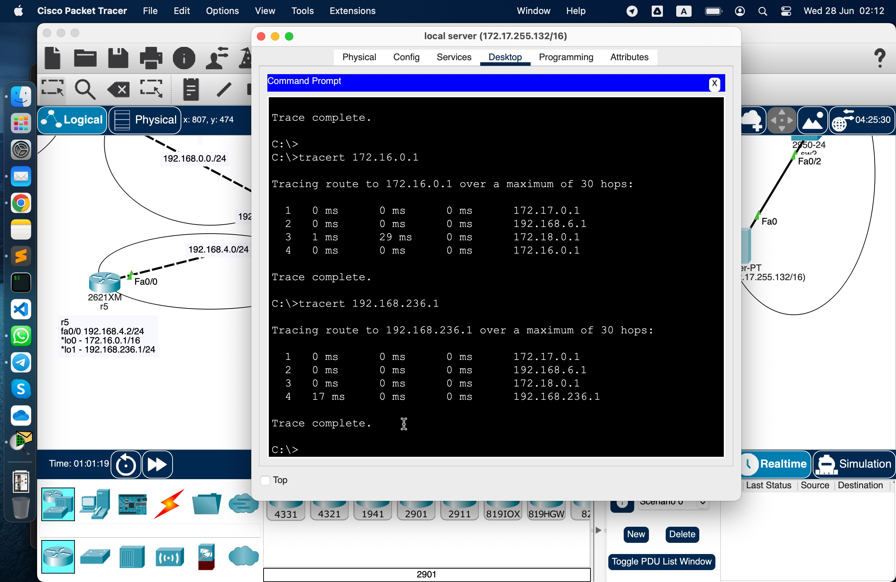

# Урок 3. Технология Ethernet. Протокол IP. Статическая маршрутизация.

Условие:

## Усложняем сеть из предыдущего домашнего задания

Используя только статическую маршрутизацию связать сеть компов и сервера

## Проверить работоспособность сети

командой ping с компов до сервера и обратно

Попробовать настроить статику
так, чтобы пинговались все интерфейсы отовсюду.

Попрактиковаться в использовании команды tracert

## Изучить получившиеся таблицы маршрутизации

Смотри логи CLI с роутеров в файлах

## Настроить loop back интерфейсы, статику до них и они тоже должны пинговаться

