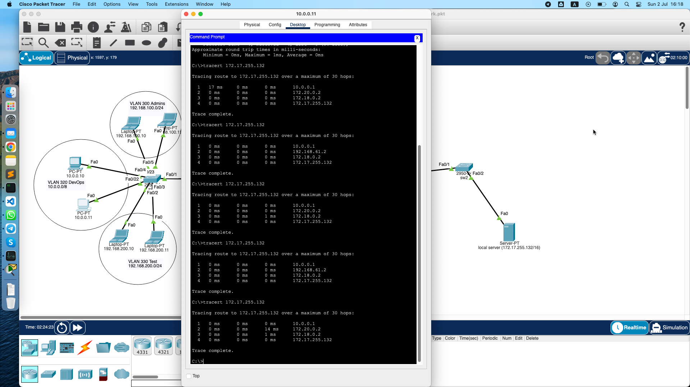
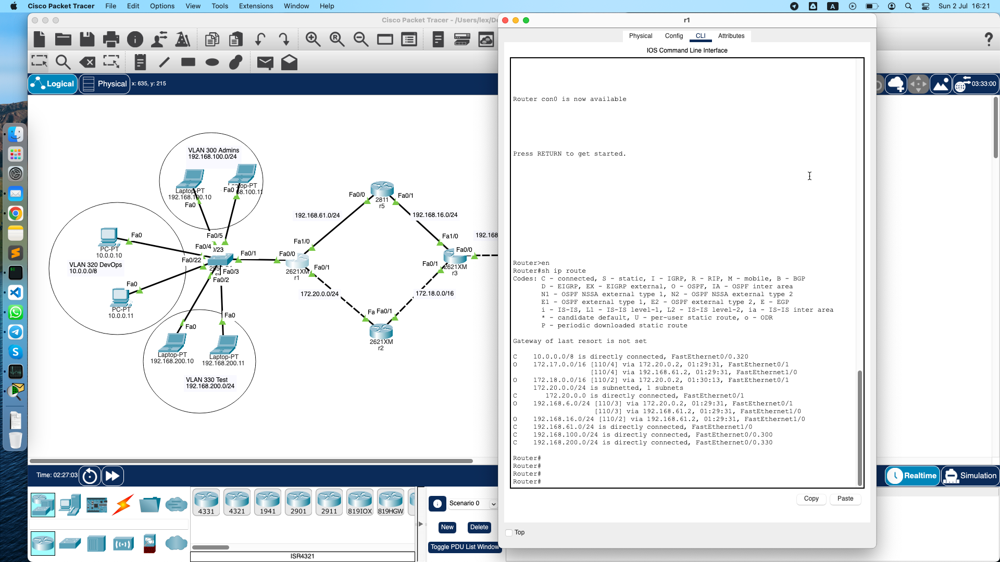
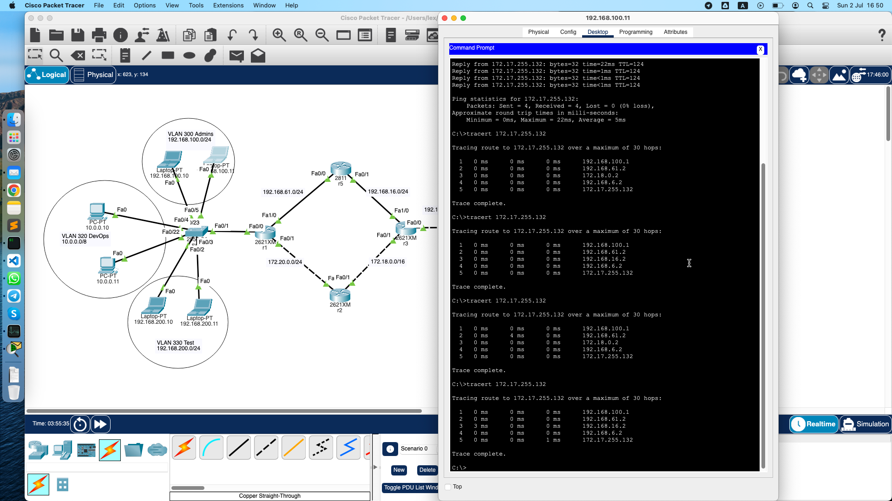
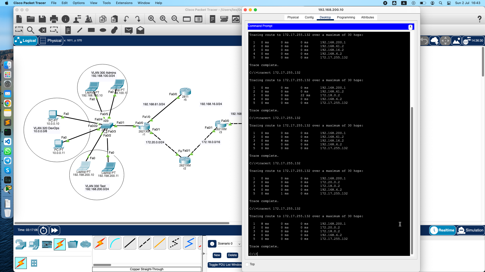
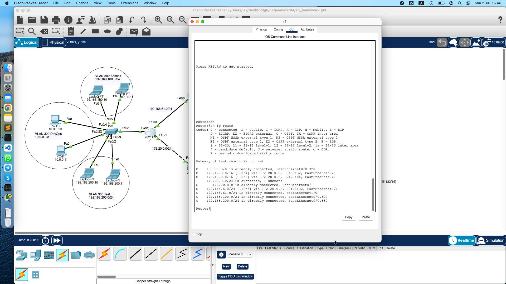

## Урок 4. Основы компьютерных сетей. Сетевой уровень. Протоколы маршрутизации. VLAN.

Условие:

## 1. Настроить сеть согласно схеме в файле с помощью OSPF и VLAN.

Починить неработающие линки.
См. логи CLI с роутеров и коммутаторов.

[r1](./Router1.sh)
[sw1](./switch1.sh)
[r2](./Router2.sh)
[r3](./Router3.sh)
[r4](./Router4.sh)
[r5](./Router5.sh)
[sw2](./Switch2.sh)

## 2. Убедиться что трафик от компов до сервера ходит через два маршрута

с помощью IСМР.

## 3. Скинуть скриншот с таблицей маршрутизации с r1.

Должны быть сети Connected для VLAN’ов.

## 4. Поймать трейс на любом компе,

когда он пойдет через r5.

Удалить один из линков на r5. Снова сделать трейс, убедиться что трафик пошел по резервному пути.

Скинуть еще один скриншот с изменившейся таблицей маршрутизации с r1.

