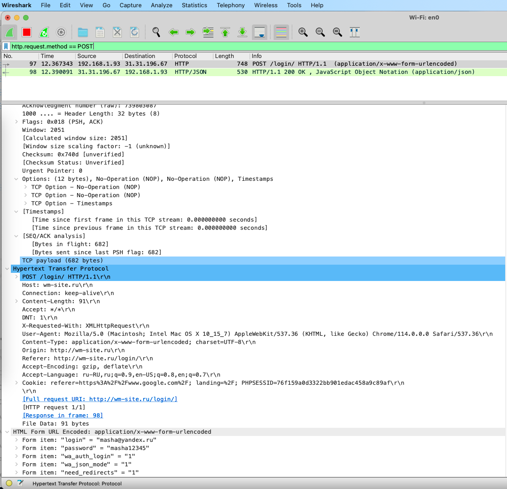
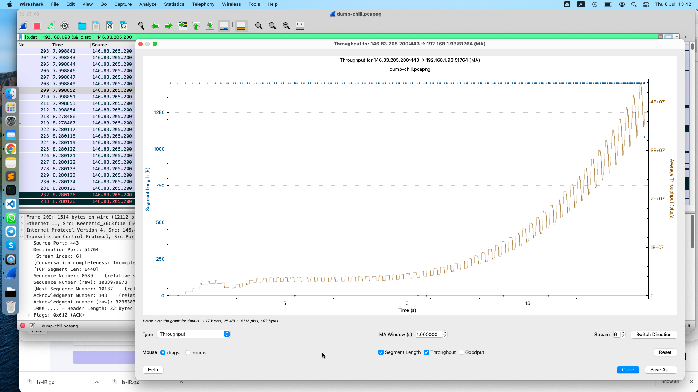
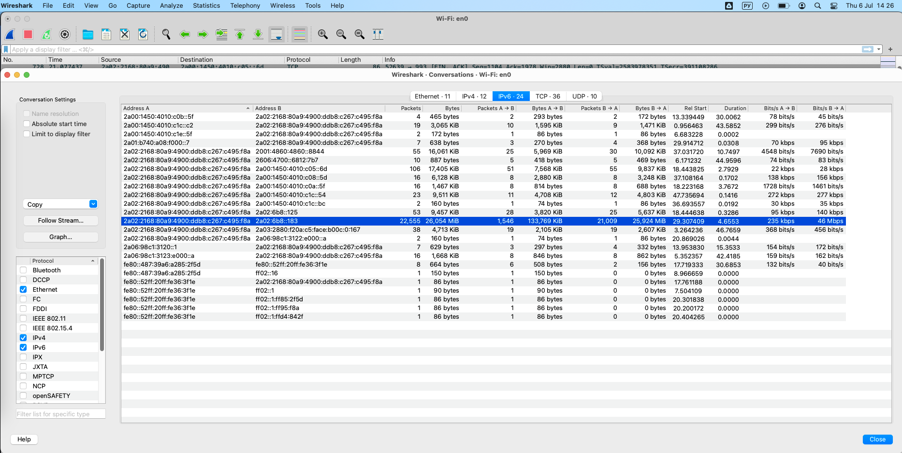

# Урок 5. Основы компьютерных сетей. Транспортный уровень. UDP и TCP.

## В приложенном файле “The Ultimate PCAP.pcap” (из раздаточного материала) найти e-mail.


Что внутри письма и для кого оно?


Внутри письма много раз повторяется строка символов

```
AABBCCDDEEFFGGHHIIJJKKLLMMNNOOPPQQRRSSTTUUVVWWXXYYZZ00112233445566778899
```

Письмо для адресата **<johannes@webertest.net>**

См. файл письма [SMTP_Ping.eml](./SMTP_Ping.eml)

## Запустите трейс до 8.8.8.8.

И перехватите его в Wireshark. Проанализируйте.


## Найдите еще один сайт без шифрования с возможностью ввода логина/пароля.

(можно в гугл настроить соответствующую выдачу по запросу с ключом “-inurl:https” в конце).

**http://wm-site.ru/login/**


Перехватите их в Wiresharke, построив фильтр.

Сначала в Wiresharke надо включить захват, кнопка с плавником "Start capturing packets".
Затем выполнить действия в браузере.
После этого в Wiresharke можно отфильтровать http POST-запросы

```
http.request.method == POST
```

БЕЗ кавычек!!! на MacOS m2



## На сайте https://launchpad.net/ubuntu/+archivemirrors

представлены зеркала с образами Убунту по странам.

Скачайте файл ls-lR.gz из Чили и с Яндекса.

Снимите два дампа для каждого скачивания.

Проанализируйте скорость скачивания и посмотрите tcptrace. Прикиньте средний RTT и поищите максимальный RWND для скачивающего.
Предоставить скриншоты графиков скорости и tcptrace. Есть ли разница? В чем она?

Очевидно, что с Яндекса убунту скачалась в разы быстрее, т.к. загрузка шла из Москвы в Москву, и наверно, с Ростелека на Ростелек.

Для Яндекса были сильно меньше RTT и сильно больше RWND.

### Чили в папке [Chili](./Chili/) [dump-chili](./Chili/dump-chili.pcapng)

IP range details 146.83.205.0/24

Red Universitaria Nacional

address Jose Domingo Cañas, 2819, Ñuñoa

Country Chile

Файл скачался за 20 секунд.

tcptrace


RTT


RWND


пропускная способность


### Яндекс в папке [Yandex](./Yandex/) [dump-yandex](./Yandex/dump-yandex.pcapng)

Все время получался дамп, который было невозможно проанализировать,

там не было Яндекса, он непонятно куда девался.

Пришлось даже силком узнать IP страницы скачивания


но это не помогло.

Wireshark не видела и не ловила трафик.

Я потратила очень много времени, пока догадалась, что в

Statictics -> Conversations

надо искать скачанные мегатайты не во вкладке IPv4, а во вкладке IPv6.



Файл скачался меньше, чем за 5 секунд.

tcptrace


RTT


RWND


пропускная способность


