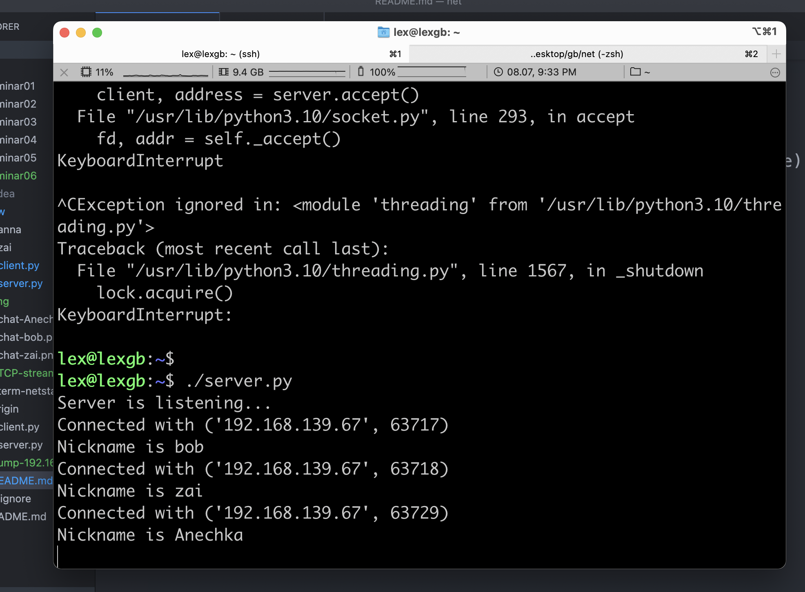
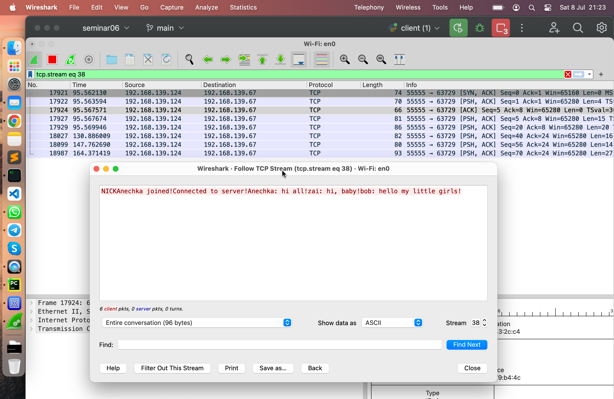

# Урок 6. Основы компьютерных сетей. Транспортный уровень. UDP и TCP.

## Напишите свою программу сервер и запустите её.

(если опыта в python нет, запустите готовый код и разберитесь, как он работает - файл с кодом готового клиента: https://disk.yandex.ru/d/cAfsjjG_mLqF3A

файл с кодом готового сервера: https://disk.yandex.ru/d/qrj4qpiXhXVwgw )

На виртуальной машине UTM запустила ubuntu server, UTM дает ей ip в моей локалке.

Команда ip a возвращает 192.168.139.124/24

Зашла на ubuntu по ssh на адрес 192.168.139.124

Использовала готовый код сервера.
Файл сервера скопировала, дала +х на выполнение и запустила ./server.py

На клиенте добавила только поддержку русского языка

```python
decode('utf-8')
encode('utf-8')
```

и запрос ip-адреса сервера.

```python
# Enter server's IP-address

serverip = input("Enter IP-address of server: ")
...
client.connect((serverip, 55555))
```

Больше не знаю что придумать.
Хотела на сервере писать лог, но не получилось - нао учить библиотеку, это не бысро, у меня нет опыта.

## Запустите несколько клиентов. Сымитируйте чат.

запустила три клиента через PyCharm


## скриншоты работающего чата.



## Отследите сокеты с помощью команды netstat.

(тоже пришлите скриншот именно сокетов вашего чата)


## Перехватите трафик своего чата в Wireshark и cшейте сессию.

Пришлите скриншот сшитой сессии с диалогом.

Эту часть делала на следующий день, поэтому скриншоты с чатами не соответствуют сшттой сессии.


