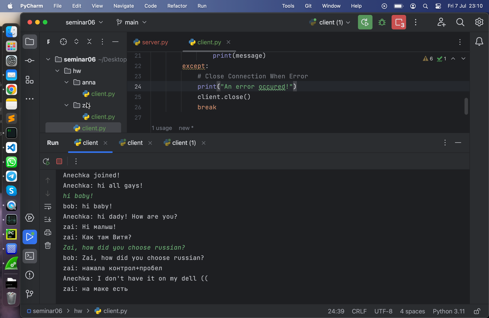
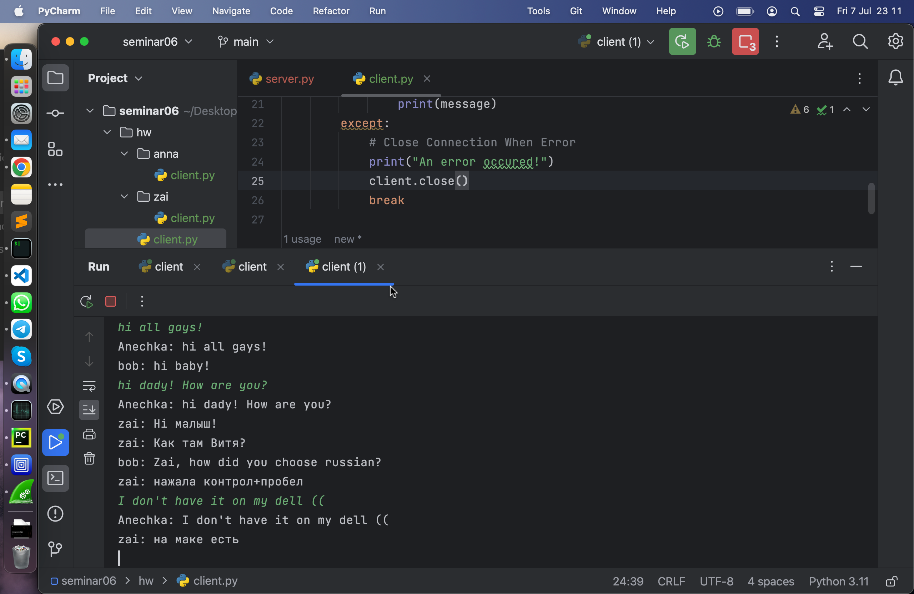
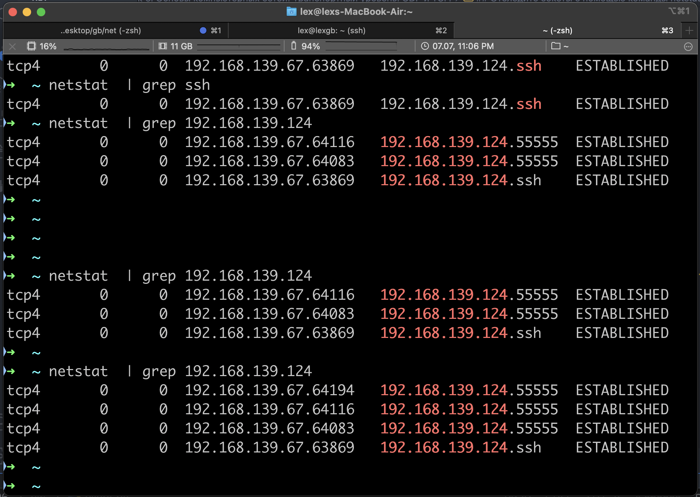

# Урок 6. Основы компьютерных сетей. Транспортный уровень. UDP и TCP.

## Напишите свою программу сервер и запустите её.

(если опыта в python нет, запустите готовый код и разберитесь, как он работает - файл с кодом готового клиента: https://disk.yandex.ru/d/cAfsjjG_mLqF3A файл с кодом готового сервера: https://disk.yandex.ru/d/qrj4qpiXhXVwgw )

В ВМ UTM запустила ubuntu server.

Зашла на нее по ssh на адрес 192.168.139.124

Использовала готовый код сервера.

На клиенте добавила только поддержку русского языка

decode('utf-8')
encode('utf-8')

## Запустите несколько клиентов. Сымитируйте чат.

запустила три клиента через PyCharm

## Отправьте мне код написанного сервера

(можете через github, если удобно или прямо здесь в txt формате) и скриншоты работающего чата.

## Отследите сокеты с помощью команды netstat.

(тоже пришлите скриншот именно сокетов вашего чата)

## Перехватите трафик своего чата в Wireshark и cшейте сессию.

Пришлите скриншот сшитой сессии с диалогом.
