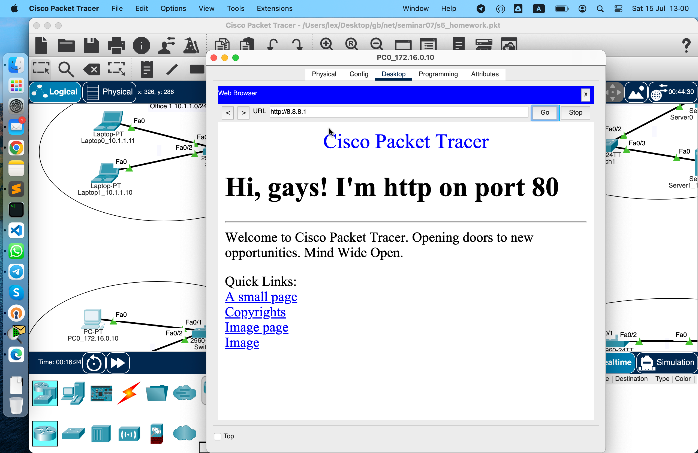
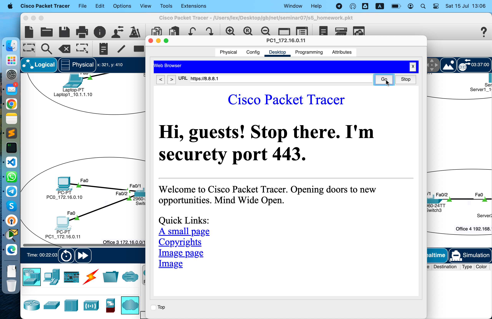
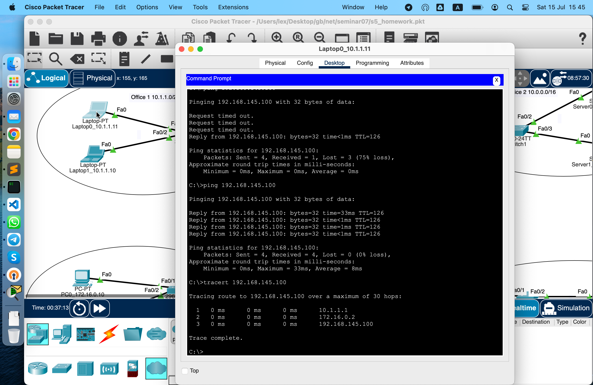
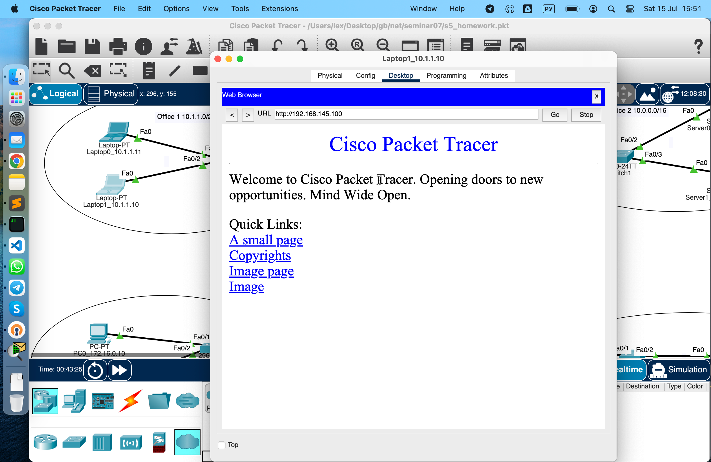
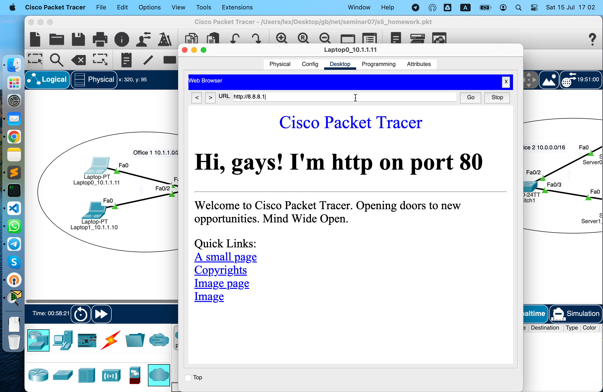
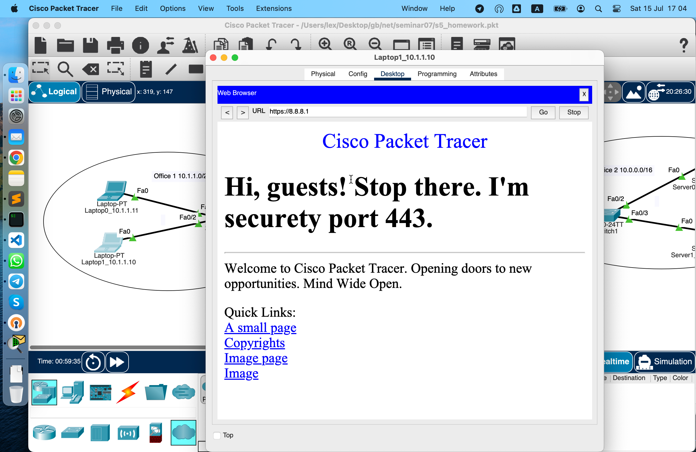
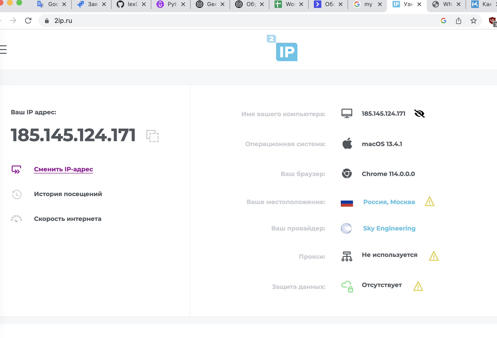
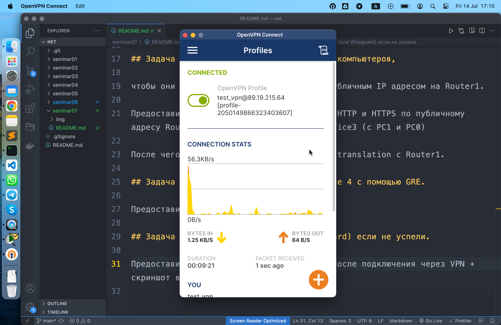
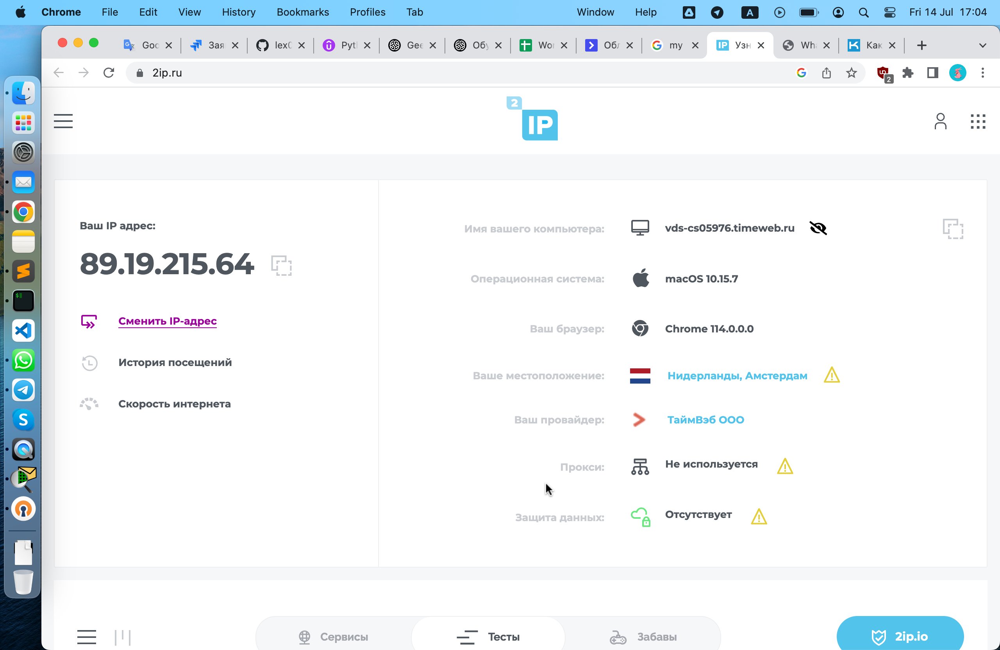

# Урок 7. NAT. GRE.

## Условие:

Настроить сеть согласно схеме в файле
https://disk.yandex.ru/d/hegGC7woXSjz0g где:
Office 1 - cеть 10.1.1.0/24
Office 2 - cеть 10.0.0.0/16
Office 3 - cеть 172.16.0.0/16
Office 4 - cеть 192.168.145.0/24
Где “Интернет” - там имитация Интернета с помощью OSPF, выберите сами публичные сети между роутерами.

## Задача 1. Настроить на Port Forwarding на сервера в Office 2.

Server0 должен предоставлять HTTP по 80му порту, а Server1 должен предоставлять HTTPS по 443 порту. Странички должны быть разные.

```bash
Router(config)#ip nat inside source static tcp 10.0.1.100 80 8.8.8.1 80
Router(config)#ip nat inside source static tcp 10.0.1.101 443 8.8.8.1 443
```

См. весь лог CLI в файле [/logs/Router3.sh](./logs/Router3.sh)

## Задача 2. Настроить PAT в Office 3 для компьютеров,

чтобы они выходили в интернет под одним публичным IP адресом на Router1.

```bash
Router(config)#ip access-list standard NET_172.16.0.0/16
Router(config-)#permit 172.16.0.0 0.0.255.255
```

См. весь лог CLI в файле [/logs/Router1.sh](./logs/Router1.sh)

Предоставить скриншот открытых страниц по HTTP и HTTPS по публичному адресу Router3 в веб-браузере клиентов Office3 (с РС1 и РС0)

Заходим с обоих компьютеров Офиса 3 на сервер 0, который слушает 80-й порт и отдает http.




Заходим с обоих компьютеров Офиса 3 на сервер 1, который слушает 443-й порт и отдает https.




После чего предоставить вывод show ip nat translation c Router1.

```bash
Router>en
Router#sh ip nat ?
  statistics    Translation statistics
  translations  Translation entries
Router#sh ip nat tr
Router#sh ip nat translations
Pro  Inside global     Inside local       Outside local      Outside global
tcp 6.6.6.1:1024       172.16.0.11:1025   8.8.8.1:80         8.8.8.1:80
tcp 6.6.6.1:1025       172.16.0.10:1025   8.8.8.1:80         8.8.8.1:80
tcp 6.6.6.1:1026       172.16.0.10:1026   8.8.8.1:443        8.8.8.1:443
tcp 6.6.6.1:1027       172.16.0.10:1027   8.8.8.1:443        8.8.8.1:443
tcp 6.6.6.1:1028       172.16.0.11:1026   8.8.8.1:443        8.8.8.1:443

Router#
```

## Задача 3. Связать сети Office 1 и Office 4 с помощью GRE.

Сделаем туннельную сеть между офисами 172.16.0.0/24

с концами 172.16.0.1 и 172.16.0.2

Мы ограничены только приватными адресами.

В туннелях публичные нельзя!

Пример настройки туннеля на ройтере 7 с сервером 1.

```bash
Router>en
Router#sh run
Building configuration...

Current configuration : 1073 bytes
!
version 15.1
no service timestamps log datetime msec
no service timestamps debug datetime msec
no service password-encryption
!
hostname Router
!
ip cef
no ipv6 cef
!
license udi pid CISCO2911/K9 sn FTX1524DLV2-
!
!
spanning-tree mode pvst
!
!
interface Tunnel333
 ip address 172.16.0.2 255.255.255.0
 mtu 1476
 tunnel source GigabitEthernet0/3/0
 tunnel destination 5.5.5.1
!
!
interface GigabitEthernet0/0
 ip address 192.168.145.1 255.255.255.0
 ip nat inside
 duplex auto
 speed auto
!
interface GigabitEthernet0/1
 no ip address
 duplex auto
 speed auto
 shutdown
!
interface GigabitEthernet0/2
 no ip address
 duplex auto
 speed auto
 shutdown
!
interface GigabitEthernet0/3/0
 ip address 7.7.7.1 255.255.255.0
 ip nat outside
!
interface Vlan1
 no ip address
 shutdown
!
router ospf 1
 router-id 7.7.7.7
 log-adjacency-changes
 network 7.7.7.0 0.0.0.255 area 0
!
ip classless
ip route 10.1.1.0 255.255.255.0 172.16.0.1
!
ip flow-export version 9
!
line con 0
!
line aux 0
!
line vty 0 4
 login
!
end
Router#
```

См. логи CLI с роутеров офиса 1 и офиса 4

с настройкой GRE туннеля.

[для офиса 1 Router0-GRE](./logs/Router0-GRE.log)

[для офиса 4 Router7-GRE](./logs/Router7-GRE.log)

Предоставить трейс с Laptop0 до Server2.



Заходим с Laptop1 на Server2



Для компьютеров из офиса 1 настроила nat со списком всей сети,

чтобы они могли ходить в интернет, на сервера 8.8.8.1





Cм. лог CLI с роутера 0 [logs/Router0.sh](./logs/Router0.sh)

## Задача 4. Доделать OpenVPN (или Wireguard) если не успели.

Предоставить скриншот публичного IP до и после подключения через VPN + скриншот вывода команды ip addr.

Вывод **ifconfig** с терминала компьютера

Видим две строчки **inet**

настоящий приватный IP в локалке **192.168.3.239**

и тунельный **172.27.232.10**

```bash
➜  ~
➜  ~ ifconfig -a | grep inet
	inet 127.0.0.1 netmask 0xff000000
	inet6 ::1 prefixlen 128
	inet6 fe80::1%lo0 prefixlen 64 scopeid 0x1
	inet6 fe80::2c56:57ff:fe44:1458%anpi0 prefixlen 64 scopeid 0x4
	inet6 fe80::2c56:57ff:fe44:1459%anpi1 prefixlen 64 scopeid 0x5
	inet6 fe80::a88f:d9ff:fe43:2cc4%ap1 prefixlen 64 scopeid 0xa
	inet6 fe80::18be:2c4c:1a68:929%en0 prefixlen 64 secured scopeid 0xb
	inet 192.168.3.239 netmask 0xfffffc00 broadcast 192.168.3.255
	inet6 fe80::9870:3bff:fed7:2f01%awdl0 prefixlen 64 scopeid 0xc
	inet6 fe80::9870:3bff:fed7:2f01%llw0 prefixlen 64 scopeid 0xd
	inet6 fe80::ca78:e150:75b5:3b52%utun0 prefixlen 64 scopeid 0xf
	inet6 fe80::a29f:fd09:5cf5:2e99%utun1 prefixlen 64 scopeid 0x10
	inet6 fe80::ce81:b1c:bd2c:69e%utun2 prefixlen 64 scopeid 0x11
	inet 172.27.232.10 --> 172.27.232.1 netmask 0xfffff800
➜  ~
```

Вывод по ssh с сервера, где крутится OpenVPN

Видим интерфейс **as0t1** с нашим gateway **172.27.232.1**

и интерфейс **eth0** с настоящим голландским IP **89.19.215.64**

```bash
root@1728999-cs05976:~#
root@1728999-cs05976:~# ifconfig
as0t0: flags=4305<UP,POINTOPOINT,RUNNING,NOARP,MULTICAST>  mtu 1500
        inet 172.27.224.1  netmask 255.255.248.0  destination 172.27.224.1
        inet6 fe80::2d0c:9b35:65f0:d983  prefixlen 64  scopeid 0x20<link>
        unspec 00-00-00-00-00-00-00-00-00-00-00-00-00-00-00-00  txqueuelen 200  (UNSPEC)
        RX packets 0  bytes 0 (0.0 B)
        RX errors 0  dropped 0  overruns 0  frame 0
        TX packets 76  bytes 3648 (3.6 KB)
        TX errors 0  dropped 0 overruns 0  carrier 0  collisions 0

as0t1: flags=4305<UP,POINTOPOINT,RUNNING,NOARP,MULTICAST>  mtu 1500
        inet 172.27.232.1  netmask 255.255.248.0  destination 172.27.232.1
        inet6 fe80::c4dc:949:c2b8:a558  prefixlen 64  scopeid 0x20<link>
        unspec 00-00-00-00-00-00-00-00-00-00-00-00-00-00-00-00  txqueuelen 200  (UNSPEC)
        RX packets 206020  bytes 24423460 (24.4 MB)
        RX errors 0  dropped 0  overruns 0  frame 0
        TX packets 861783  bytes 1052321048 (1.0 GB)
        TX errors 0  dropped 0 overruns 0  carrier 0  collisions 0

eth0: flags=4163<UP,BROADCAST,RUNNING,MULTICAST>  mtu 1500
        inet 89.19.215.64  netmask 255.255.255.0  broadcast 89.19.215.255
        inet6 fe80::e016:deff:fe9f:cd43  prefixlen 64  scopeid 0x20<link>
        ether e2:16:de:9f:cd:43  txqueuelen 1000  (Ethernet)
        RX packets 1772874  bytes 1674316845 (1.6 GB)
        RX errors 0  dropped 0  overruns 0  frame 0
        TX packets 1936346  bytes 1241052484 (1.2 GB)
        TX errors 0  dropped 0 overruns 0  carrier 0  collisions 0

lo: flags=73<UP,LOOPBACK,RUNNING>  mtu 65536
        inet 127.0.0.1  netmask 255.0.0.0
        inet6 ::1  prefixlen 128  scopeid 0x10<host>
        loop  txqueuelen 1000  (Local Loopback)
        RX packets 14038  bytes 2033172 (2.0 MB)
        RX errors 0  dropped 0  overruns 0  frame 0
        TX packets 14038  bytes 2033172 (2.0 MB)
        TX errors 0  dropped 0 overruns 0  carrier 0  collisions 0

root@1728999-cs05976:~#
```

Скрин с сайта **https://2ip.ru/** без включенного VPN



Трейсер до голландского сайта

```bash
➜  ~ traceroute www.amsterdam.nl
traceroute: Warning: www.amsterdam.nl has multiple addresses; using 172.67.15.22
traceroute to www.amsterdam.nl.cdn.cloudflare.net (172.67.15.22), 64 hops max, 52 byte packets
 1  unifi (192.168.0.1)  2.979 ms  3.057 ms  2.242 ms
 2  172.16.0.1 (172.16.0.1)  2.572 ms  3.193 ms  13.951 ms
 3  185.145.124.129 (185.145.124.129)  3.162 ms  2.717 ms  3.042 ms
 4  172.31.253.1 (172.31.253.1)  4.628 ms  4.850 ms  4.194 ms
 5  172.31.255.1 (172.31.255.1)  3.311 ms  3.516 ms  3.251 ms
 6  31.28.19.100 (31.28.19.100)  3.293 ms  22.325 ms  5.951 ms
 7  10.10.13.153 (10.10.13.153)  32.985 ms  10.959 ms  10.840 ms
 8  * * *
 9  * * *
10  172.67.15.22 (172.67.15.22)  16.714 ms * *
➜  ~
```

Включили VPN



Скрин с сайта **https://2ip.ru/**



Трейсер до голландского сайта

```bash
➜  ~ traceroute www.amsterdam.nl
traceroute: Warning: www.amsterdam.nl has multiple addresses; using 104.22.4.8
traceroute to www.amsterdam.nl.cdn.cloudflare.net (104.22.4.8), 64 hops max, 52 byte packets
 1  172.27.232.1 (172.27.232.1)  52.022 ms  50.585 ms *
 2  * * *
 3  5.39.223.251 (5.39.223.251)  53.233 ms
    5.39.223.253 (5.39.223.253)  51.746 ms  64.081 ms
 4  * * 5.39.223.253 (5.39.223.253)  55.484 ms
 5  * 141.101.65.2 (141.101.65.2)  66.589 ms *
 6  * 104.22.4.8 (104.22.4.8)  58.304 ms *
➜  ~
```

Даже версия мак оси понизилась.
