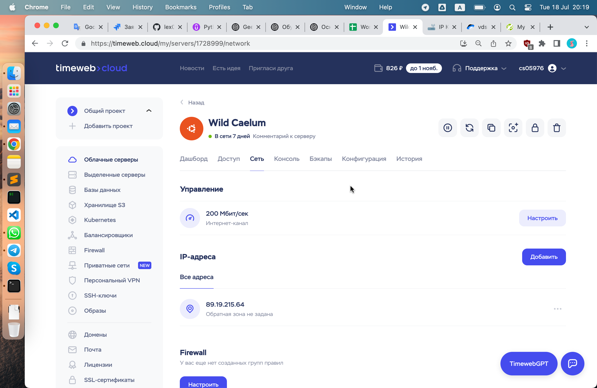
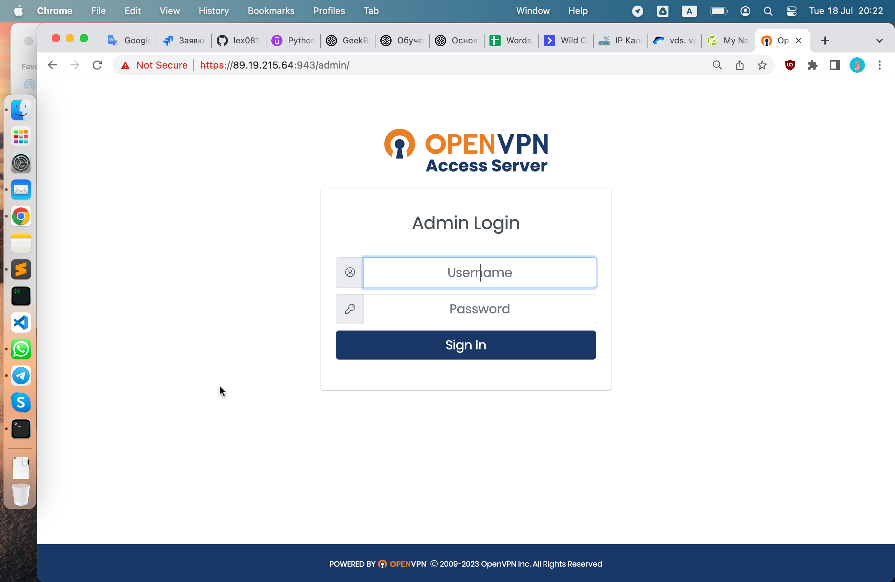
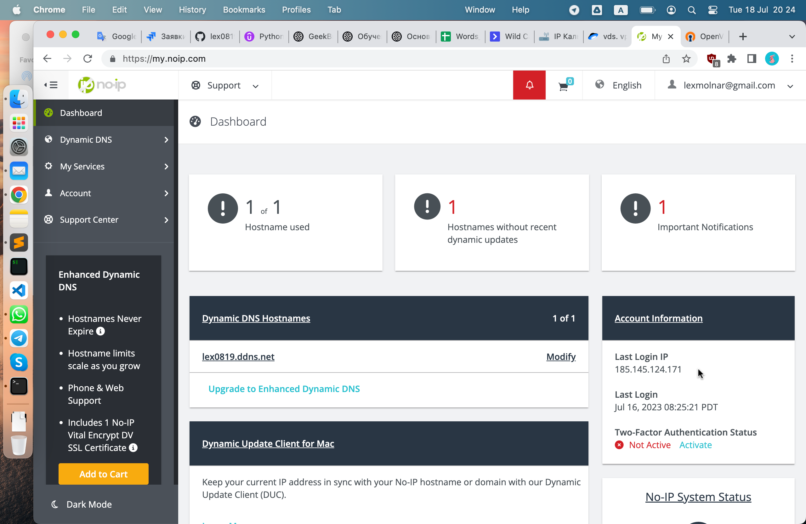
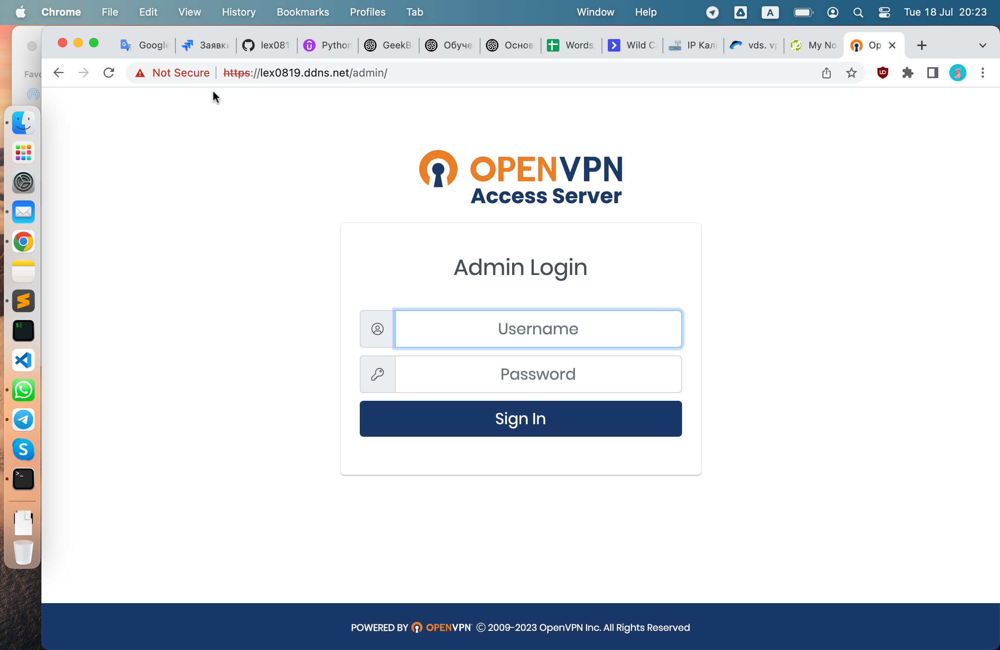
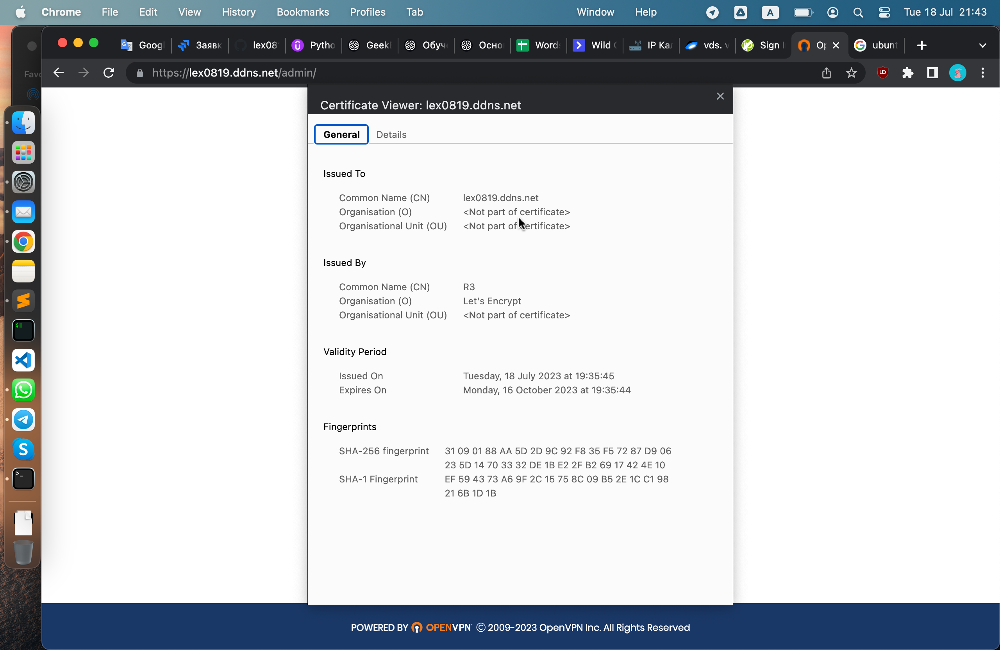
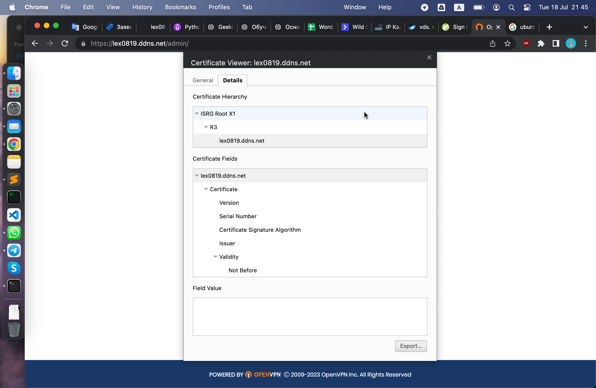

# Урок 8. Основы HTTP/HTTPS и DNS

## Доделать свой сертификат

На timeweb.ru куплен облачный сервер.
Предоставляется только ip, никакого доменного имени не предоставлено!



На машину установлен openvpn и можно зайти на его страницы в браузере.



Доменное имя получено на noip.com по тарифу free - только один домен с записью типа А.



Заходим на домен и видим отсутствие сертификата



Cертификат SSL получаем на letsencrypt.org через программу certbot в терминале.

Работа в CLI производится на том же удаленном сервере от таймвеба где уже стоит openvpn.

После завершения успешной работы certbot, необходимо ребутнуть всю машину, а не только сам сервис openvpn!

Хотя

```bash
/usr/local/openvpn_as/scripts/sacli start
```

вроде бы рестартует openvpn, - этого не достаточно! Секьюрити не появляется.

```bash
root@1728999-cs05976:~# apt update && apt upgrade
...
root@1728999-cs05976:~# apt install certbot
...
root@1728999-cs05976:~# certbot --version
certbot 1.21.0

root@1728999-cs05976:~# certbot certonly --standalone
...
Account registered.
Please enter the domain name(s) you would like on your certificate (comma and/or
space separated) (Enter 'c' to cancel): lex0819.ddns.net
Requesting a certificate for lex0819.ddns.net

Successfully received certificate.
Certificate is saved at: /etc/letsencrypt/live/lex0819.ddns.net/fullchain.pem
Key is saved at: /etc/letsencrypt/live/lex0819.ddns.net/privkey.pem
This certificate expires on 2023-10-16.

root@1728999-cs05976:~# /usr/local/openvpn_as/scripts/sacli --key "cs.priv_key" --value_file "/etc/letsencrypt/live/lex0819.ddns.net/privkey.pem" ConfigPut
root@1728999-cs05976:~#
root@1728999-cs05976:~# /usr/local/openvpn_as/scripts/sacli --key "cs.cert" --value_file "/etc/letsencrypt/live/lex0819.ddns.net/fullchain.pem" ConfigPut
root@1728999-cs05976:~#
root@1728999-cs05976:~# /usr/local/openvpn_as/scripts/sacli start
RunStart warm None
{
"active_profile": "Default",
"errors": {},
"last_restarted": "Tue Jul 18 19:56:21 2023",
"service_status": {
"api": "on",
"auth": "on",
"bridge": "on",
"client_query": "restarted",
"crl": "on",
"daemon_pre": "on",
"db_push": "on",
"ip6tables_live": "on",
"ip6tables_openvpn": "on",
"iptables_api": "on",
"iptables_live": "on",
"iptables_openvpn": "on",
"iptables_web": "restarted",
"log": "on",
"openvpn_0": "on",
"openvpn_1": "on",
"subscription": "on",
"user": "on",
"web": "restarted"
}
}
WILL_RESTART ['web', 'client']
root@1728999-cs05976:~#
root@1728999-cs05976:~# reboot
root@1728999-cs05976:~# Connection to 89.19.215.64 closed by remote host.
Connection to 89.19.215.64 closed.
➜ ~
```

Примерные команды CLI для OpenVPN можно посмотреть на

https://openvpn.net/vpn-server-resources/managing-settings-for-the-web-services-from-the-command-line/

**Set up the configuration database keys**

_/usr/local/openvpn_as/scripts/sacli --key "cs.priv_key" --value_file "/etc/letsencrypt/live/lex0819.ddns.net/privkey.pem" ConfigPut_

_/usr/local/openvpn_as/scripts/sacli --key "cs.cert" --value_file "/etc/letsencrypt/live/lex0819.ddns.net/fullchain.pem" ConfigPut_

_/usr/local/openvpn_as/scripts/sacli start_

После установки сертификата и ребута машины заходим на домен и видим секьюрити. Все работает.





## Настроить сеть согласно информации на схеме

(https://disk.yandex.ru/d/Vaxkf2X0RG9NGw .)

Сымитировать "Интернет" с помощью OSPF. Приватных сетей в маршрутизации быть не должно.

Для компьютеров из Office 1 предоставить доступ в "Интернет" с помощью PAT.

Открыть доступ из "Интернета" к серверам из Office 2 c помощью Port Forwarding.

Для компьютеров из Office 1 должны открываться разные сайты по HTTP и HTTPS из Office 2 по одному доменному имени.

Предоставить скриншоты открытых разных сайтов по одному доменному имени.

Предоставить скриншот таблицы NAT трансляций с Router3.

Предоставить скриншот таблицы маршрутизации с Router0.
